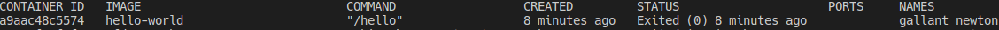
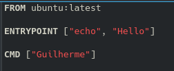

# Trabalhando com as Imagens

Iremos mostrar como criar a tua primeira imagem docker, utilizando o Dockerfile.

Nesse passo a passo, mostraremos também como subir a imagem para o Docker Hub, assim sendo, caso queira fazer essa etapa, crie sua conta em [Docker Hub](https://hub.docker.com/).

## Entendendo melhor o Dockerfile

Para realmente criarmos nossa imagem, precisamos entender as principais partes do Dockerfile, dessa forma iremos mostrar um exemplo básico do arquivo para explicar cada uma dessas partes.

Crie um novo diretório com a seguinte estrutura:


O conteúdo do meu arquivo index.html de exemplo ficou assim:

```html
<!DOCTYPE html>
<html>
  <head>
    <meta charset="utf-8">
    <title>Exemplo</title>
  </head>
  <body>
    <h1>Tudo certo!</h1>
  </body>
</html>
```

O arquivo Dockerfile não tem extensão e o conteúdo desse Dockerfile de exemplo ficou da seguinte forma:

```
FROM nginx:1.19

RUN apt-get update && \
    apt-get install vim -y

COPY ./html/ /usr/share/nginx/html/

EXPOSE 80
```

Entendendo as partes do Dockerfile

- FROM

  Informa a imagem base que você utilizará para montar a tua imagem. No nosso exemplo utilizaremos a imagem base do nginx como sendo a versão da mesma a 1.19, no Docker Hub você consegue encontrar as tags existentes para a imagem, caso não seja informada, sua imagem será criada a partir da latest (Imagem mais atual no repositório).

  Caso tu queira criar uma imagem configurando tudo que for necessário, tu pode utilizar como base a imagem do ubuntu ou alpine, por exemplo.

- RUN

  Executa algum comando passado. Neste exemplo estamos executando o update do linux e a instalação do vim, que não vem na imagem do nginx por padrão.

- COPY

  Como o próprio nome já diz, esse comando faz a cópia de um diretório ou arquivo do host para a imagem. O arquivo/pasta precisará estar visível a partir do diretório onde o Dockerfile se encontra.

- EXPOSE

  Expõe uma ou mais portas da imagem para o host poder utilizar

## Criando nossa primeira imagem

Para criarmos nossa imagem de uma forma mais simples, precisamos entrar pelo terminal no diretório onde o Dockerfile está.

Dentro do diretório iremos rodar o seguinte comando:

```
docker build -t usuario-dockerhub/exemplo-docker:latest .
```

Iremos substituir as seguintes partes:

- usuario-dockerhub

  Incluiremos aqui nosso usuário criado no dockerhub, para posterior envio da nossa imagem.

- exemplo-docker

  Aqui iremos colocar o nome que gostaríamos de dar para a nossa imagem.

- latest

  Utilizaremos o latest nos nossos exemplos, mas é possível criar as tags seguindo algum versionamento seu.

Obs.: O docker não aceita CamelCase, assim sendo não conseguiríamos utilizar "usuarioDockerhub/exemploDocker" como nome da nossa imagem, por isso separei as informações com hífens.

Caso execute o comando da forma que está, não ocorrará problema no build e quando você rodar o comando "docker images", irá aparecer a imagem criada, como podemos ver a seguir:


Feito o build já podemos rodar a nossa imagem em um novo container com o seguinte comando (Lembre-se de colocar o mesmo nome de usuário/imagem que utilizou para fazer o build):

```
docker run -it --rm -p 80:80 -d usuario-dockerhub/exemplo-docker
```

Com esse comando estaremos criando um novo container que estará rodando a nossa imagem criada anteriormente, o parâmetro -p está fazendo o vínculo da porta 80 da máquina host com a porta 80 que foi exposta na criação da nossa imagem. Utilizamos o -d para deixar o container "desanexado" do terminal, caso rodemos sem o -d, você perceberá que irá aparecer as seguintes linhas no terminal e o mesmo estará "travado", não permitindo executar nenhum outro comando.


É importante lembrar que para que o contêiner fique "funcionando o tempo todo", é necessário que você chame algum serviço para isso, no nosso caso estamos utilizando a imagem do nginx como base, e na mesma é chamado o serviço do nginx como última etapa, para que dessa forma ele fique escutando as portas da aplicação.

Caso você crie uma imagem a partir do ubuntu, por exemplo, e não coloque nada para ficar executando, quando criar um container a partir desta imagem o container irá executar o que tem que executar e irá se autodestruir. Podemos ver isso rodando o seguinte comando:

```
docker run hello-world
```

Esse comando é normalmente utilizado para verificar se o docker está rodando, logo após instalar o mesmo, mas para o exemplo aqui ele é mais que suficiente. Caso você abra o docker hub desta imagem e clique na versão, será aberto o github onde está o arquivo Dockerfile. Para criação dessa imagem o arquivo é esse:


Podemos ver que ele foi criado a partir do "nada" e o que é feito é uma cópia de um arquivo hello para o diretório raiz da imagem e aberto esse arquivo. O arquivo é um arquivo sem extensão, mas que contém o texto que podemos ver a seguir:


Como não existe nada que ficará sendo executado por tempo indefinido, podemos rodar o comando "docker ps" e veremos que não existem nenhum container em execução, mas se você rodar o comando "docker ps -a" verá que existe no histórico o container criado para essa imagem.



Explicamos isso para que você saiba que caso crie a sua imagem a partir do ubuntu, por exemplo, e queira que o container fique funcionando o tempo todo, você precisará chamar algum serviço para isso.

## Entendendo o CMD / Entrypoint

Agora um último ponto que precisamos explicar, para chamar esse serviço utilizaremos o CMD, que executará um comando dentro do teu container. Mas existe também o ENTRYPOINT no Dockerfile, que também executa algo no container e em muitos casos as pessoas não sabem diferenciar um do outro.

Se olharmos os dois exemplos de Dockerfile a seguir, podemos ver mais claramente a diferença:




Ao fazer o build dos dois Dockerfiles e rodar os mesmos em novos containers, perceberemos que a saída será a mesma ("Hello Guilherme"), mas no primeiro exemplo temos o CMD com o comando echo sendo rodado e passamos os dois parâmetros para ele, ao contrário do segundo, onde temos o comando "echo" e mais um parâmetro no ENTRYPOINT e temos o CMD apenas com a string "Guilherme".

Dessa forma fica claro que o CMD também poderá ser interpretado como um parâmetro variável do ENTRYPOINT, que poderá ser substituído no momento da criação do container.

Levando em conta o segundo exemplo e rodando o comando a seguir para fazer o build, teremos uma imagem chamada teste-cmd-entrypoint na nossa máquina.

```
docker build -t teste-cmd-entrypoint .
```

E para substituir o CMD na criação do container, podemos rodar o seguinte:

```
 docker run teste-cmd-entrypoint World
```

Ao executar esse comando veremos que a saída será "Hello World". Assim sendo substituímos a string "Guilherme" pela string "World" no momento da criação do container.

Esse é um exemplo bem simples, mas caso seja utilizado esses dois passos no Dockerfile, é necessário se atentar a essa diferença para que não ocorra nenhum problema na criação da sua imagem.

## Publicando a imagem no DockerHub

Para publicar a imagem no docker hub é bem simples. Com a conta já criada no DockerHub, execute o seguinte comando no terminal:

```
docker login
```

Após executar o comando, você deverá informar o login e senha criados no DockerHub. Após logado no docker pelo terminal, você efetuará o envio da sua imagem para o DockerHub com o seguinte comando:

Obs.: Lembre-se de substituir as informações de usuário/imagem pelos utilizados para fazer o build da imagem.

```
docker push usuario-dockerhub/exemplo-docker
```

Nesse momento você estará efetuando o envio da sua imagem para o DockerHub, essa etapa pode levar um certo tempo dependendo do tamanho da sua imagem local. Após finalizar o envio da imagem, você poderá logar no site do DockerHub e verá que a sua imagem já estará aparecendo lá e você conseguirá utilizar a mesma em qualquer outra máquina.