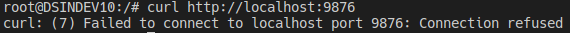

# Docker Network

A função básica da rede "interna" do docker é fazer dois ou mais containers se comunicarem.

Normalmente criamos containers separados para cada um dos serviços (Ex.: Nginx e MySQL) ao invés de criar uma imagem com tudo que precisamos. Dessa forma é importante fazermos com que esses containers se comuniquem.

## Verificando as redes padrões do docker

Para verificar as redes padrões já criadas, podemos executar o seguinte comando:

```
docker network ls
```

Rodando esse comando podemos ver na imagem a seguir que temos algumas redes criadas na nossa máquina


## Entendendo os tipos básicos das networks

Aqui falaremos de alguns tipos básicos de network, mas não entraremos em detalhes sobre todos esses tipos.

### None

Esse tipo tem como objetivo isolar completamente o container de comunicações externas. Deixando apenas o localhost interno do container acessível.

 Normalmente utilizado para containers que tem como função a manipulação de arquivos sem necessidade de enviá-los para nenhum outro local via rede, podendo colocar esses arquivos em um docker volume.

### Bridge

Faz com que um container se comunique facilmente com o outro.

Nesse tipo de rede, todos os containers poderão se comunicar pelo protocolo TCP/IP. Devemos observar que os IPs serão cedidos automaticamente.

 Nessa rede é possível expor as portas dos containers para que as mesmas possam ser acessadas pelo host.

### Host

Faz uma mesclagem da network do docker com a network da máquina host. Dessa forma todas as interfaces existentes no host ficarão acessíveis pelo container.

 Por um lado as entregas de pacotes ficariam mais rápidas, pois não existirá uma ponte entre essas redes, mas por outro lado o uso da ponte pode ser importante para a segurança e gerenciamento do tráfego.

### Overlay

Esse tipo de network tem o objetivo de permitir a comunicação entre máquinas hosts, ou seja, duas máquinas distintas poderão subir containers separados e esses containers poderão se comunicar.

### Macvlan

Esse é o tipo mais recente de rede docker. Esse tipo criará uma sub-rede que estará "plugada" nas interfaces de rede da máquina host. Os containers serão endereçados com IPs roteáveis que estarão disponíveis nessa sub-rede.

## Trabalhando com uma rede bridge

Para exemplificar a rede bridge, iremos subir dois containers utilizando o bash (Alpine) como base.

```
docker run -d -it --name bash1 bash
docker run -d -it --name bash2 bash
```

Após subir os dois containers, podemos rodar o comando "docker ps" para confirmarmos se os dois estão rodando.


Confirmado que os containers estão rodando, vamos inspecionar nossa rede bridge padrão com o comando:

```
docker network inspect bridge
```

Na saída desse comando, podemos ver que dentro da propriedade "Containers" estão os dois containers que subimos anteriormente.


Agora, para simular a comunicação entre esses containers, vamos entrar no nosso container chamado de bash1 com o seguinte comando:

```
docker exec -it bash1 bash
```

Dentro do container, a forma mais simples de simular a comunicação com o outro container é utilizando o comando "ping". Dessa forma vamos utilizar esse comando com o IP do container bash2.

Lembre-se de substituir o IP do comando a seguir pelo IP que apareceu para o container do bash2, na execução do comando de inspect da rede bridge. No meu caso o IP do bash2 é o "172.17.0.3", então meu comando ficará assim:

```
ping 172.17.0.3
```

E podemos ver que na saída do comando a comunicação está sendo feita com o IP do bash2.


Mas se tentarmos rodar o ping com o nome do nosso container bash2, podemos ver que a rede padrão do docker não consegue fazer essa comunicação.


Para fazer com que nossa rede consiga resolver o nome do container, vamos criar nossa própria rede bridge (Coloquei esse exemplo eu coloquei o nome da rede de "minha_rede"). Podemos utilizar o comando a seguir:

```
docker network create --driver bridge minha_rede
```

Se rodarmos o comando "docker network ls", podemos ver que a nossa rede foi criada e já está listada nas redes do docker:


Agora vamos subir nossos containers bash usando essa rede que acabamos de criar:

```
docker run -dit --name bash1 --network minha_rede bash
docker run -dit --name bash2 --network minha_rede bash
```

Após subir os containers, vamos entrar no container bash1 e vamos dar um ping no bash2, igual fizemos anteriormente.

Dessa vez podemos ver que o ping funcionou corretamente, sem a necessidade de colocar o IP do container bash2. Concluímos assim que quando criamos a nossa própria rede bridge, podemos chamar os outros containers a partir do nome deles.


## Trabalhando com uma rede host

Antes de começarmos a falar sobre essa rede, devo lembrá-los que o docker foi feito para trabalhar no linux. Assim sendo, vocês poderão encontrar alguns problemas ao tentar utilizar essa rede no MacOS ou no Windows SEM o WSL2, causando alguma dificuldade ou até mesmo não permitindo que a rede funcione corretamente. No Windows com o WSL2 é um pouco diferente, pois o WSL2 é uma máquina linux "embutida" no Windows.

Com isso em mente, prosseguiremos com um exemplo simples do funcionamento da rede host do docker.

Para ficar claro, irei acessar a url http://localhost sem iniciar nenhum container. O resultado foi esse:


Agora iremos criar um novo container nginx, sem fazer o mapeamento de portas, mas informando que será utilizada a rede host padrão do docker. Para isso utilizei o seguinte comando:

```
docker run --rm -d --name nginx --network host nginx
```

Com esse container já rodando, irei acessar novamente o endereço http://localhost. Lembrando que não fizemos nenhum mapeamento da porta 80 da nossa rede para a porta 80 do container. O resultado foi esse:


Podemos ver que nesse exemplo, a rede do container foi "mesclada" a rede da nossa máquina, dessa forma qualquer porta que o container estiver escutando, nossa máquina também estará escutando. O contrário também é verdadeiro, ou seja, se a sua máquina tiver um serviço rodando em alguma porta específica, o container conseguirá acessar esse serviço também.

Para exemplificar a comunicação do container com algum serviço da máquina host, vamos entrar no nosso container e tentar acessar o endereço http://localhost:9876 através do cURL. Para isso utilizaremos o seguinte comando para acessar o container:

```
docker exec -it nginx bash
```

E dentro do container iremos tentar acessar o endereço da seguinte forma:

```
curl http://localhost:9876
```

O resultado esperado é um erro, pois não temos nada rodando na porta 9876 da nossa máquina:



Agora vamos colocar o PHP para escutar a porta 9876 da nossa máquina host. Lembrando que eu tenho o PHP instalado na minha máquina, caso você não tenha o exemplo não irá funcionar. Você pode prosseguir com a instalação do PHP ou caso prefira pode utilizar qualquer outro serviço que já esteja instalado na sua máquina, por exemplo: NodeJS, MySQL, Postgres, etc.

Para o nosso exemplo, eu criei um diretório com um arquivo index.php contendo o seguinte conteúdo:

```php
<?php echo "Arquivo existente na máquina host\n";
```

Nesse diretório eu rodei o PHP com o seguinte comando:

```
php -S localhost:9876
```

Dessa forma nossa máquina host está escutando qualquer requisição para a porta 9876. Então vamos entrar novamente no nosso container e vamos executar o comando curl para o endereço http://localhost:9876, da mesma forma que fizemos anteriormente. Dessa vez o resultado esperado é o seguinte:


Concluímos assim que quando utilizamos o tipo de rede host do docker a mesclagem das redes ocorre naturalmente. Também pudemos perceber que o container consegue acessar as portas da nossa máquina host e nossa máquina host consegue acessar as portas do container.

PS.: No docker para Windows e MacOS existe o host.docker.internal para utilizar no local do localhost, assim sendo, a url do exemplo ficará sendo http://host.docker.internal:9876.

## Conectando um container a uma rede já existente

No caso de você ter um container rodando e quiser conectar ele a uma rede já criada, podemos usar o seguinte comando:

Obs.: Lembre-se de substituir o nome da rede e o nome do container no comando.

```
docker network connect NOME_REDE NOME_CONTAINER
```

